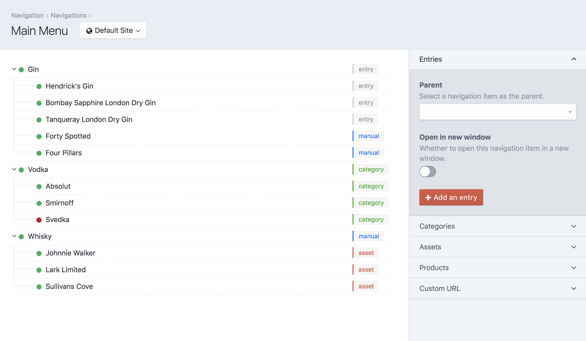

# Navigation Plugin for Craft CMS

Navigation is a Craft CMS plugin to help manage navigation menus for you site. Supports linking to existing elements like entries, categories and products, as well as custom URLs.



## Features
- Create multiple navigations
- Create navigation nodes for entries, assets, categories and Commerce products
- Create custom URLs
- Enable/disable, open links in a new window, or apply additional CSS classes
- Automatically updates nodes when linked elements status or title changes
- Navigation nodes are elements for flexible querying
- Support for third-party elements with hooks
- Support for multi-site navigations
- Simple `render()` Twig function, or roll your own
- Generate breadcrumbs easily based on your URL segments

## Requirements

This plugin requires Craft CMS 3.0.0 or later.

## Installation

To install the plugin, follow these instructions.

1. Open your terminal and go to your Craft project:

```
cd /path/to/project
```

2. Then tell Composer to load the plugin:

```
composer require verbb/navigation
```

3. In the Control Panel, go to Settings → Plugins and click the “Install” button for Navigation.

## Getting started

You'll first want to create a navigation - this contains your navigation nodes with links to elements or custom URLs. Head to "Navigation" on the main sidebar menu, and click "New Navigation" on the top-right.

Once saved, click on the navigation title to start adding your nodes.


Using the right-hand side menu, add either elements or custom URLs. Once added, they'll appear on the left-hand side in a structure. Hover over any navigation node to see some actions - move, edit and delete. Any changes you make to this structure will reflect the changes on your live site.

When linking to an existing element, the Title and Enabled settings will always reflect the original element's state. So, if you change the linked element's title or disable it, it'll reflect this change in the node. You can override the Title and Enabled settings to become independant of your element changes - if you wanted a custom title for instance.

## Templating

You have two options for outputting your menu:

### craft.navigation.render

The easy option - let Navigation output the list items for you. This will generate a nested `<ul>` list of navigation items. You can also pass in additional classes for each element.

#### Example

```twig
{{ craft.navigation.render('navHandle', {
    ulClass: 'nav-items',
    liClass: 'nav-item',
    aClass: 'nav-link',
}) }}
```

### craft.navigation.nodes

For more fine-grained control over the navigation output, you can call nodes directly. As nodes are elements, output is a breeze using Craft's `` tag, so you don't have to deal with recursive macros.

#### Example

```twig


{# Or - alternatively #}


<ul>
    
        <li>
            {{ node.link }}

            
                <ul>
                    
                </ul>
            
        </li>
    
</ul>
```

If you'd rather not use the `` functionality, you can create your own recursive macro to loop through nodes. In addition, you'll also only want to initially output the first level of nodes using the `level: 1` parameter.

```twig


<ul>
    
        {{ macros.navigationNodes(node) }}
    
</ul>


    

    <li>
        {{ node.link }}

        
            <ul>
                
                    {{ macros.navigationNodes(subnode) }}
                
            </ul>
        
    </li>

```

### craft.navigation.breadcrumbs

You can retrieve a list of elements to be used as breadcrumbs. They are not based on your navigation items, and instead use the current URL segments.

```twig

    {{ crumb.link }}

```

## Node attributes

You have access to the following attributes on navigation nodes. These are also available when querying node elements.

#### Parameters

| Parameter | Explanation |
| --------- | ----------- |
| id | ID for the node. |
| elementId | The linked element ID (if not custom). |
| element | The linked element (if not custom). |
| navId | The ID for the nav this node belongs to. |
| url | URL for this node. Either the linked element or custom. |
| title | Title for this node. Either the linked element or custom. |
| link | Full HTML link (combined url and title). |
| type | The element type. If custom, will be `null`. |
| classes | Any additional CSS classes added to the node. |
| newWindow | Whether this node should open in a new window. |
| active | Whether the URL matches the current URL. |
| nav | The navigation model this node belongs to. |
| status | The current status of the node. |
| children | A collection of child nodes (if any). |

## Node queries

As nodes are just elements, you can query nodes as per your needs. See [Element Queries](https://docs.craftcms.com/v3/dev/element-queries/#creating-element-queries) and [Entry Queries](https://docs.craftcms.com/v3/dev/element-queries/entry-queries.html).

Some common query parameters:
 
 #### Parameters
| Parameter | Explanation |
| --------- | ----------- |
| hasDescendants | Whether the current node has any children |
| level | The level in the navigation structure this node belongs to. |
| status | The current status of the node. |

## Developers

You can add your own custom elements to be compatible with Navigation by using the provided events. The below shows an example of how entries are setup.

```php
use verbb\navigation\services\Elements;
use verbb\navigation\events\RegisterElementEvent;

use yii\base\Event;

Event::on(Elements::class, Elements::EVENT_REGISTER_NAVIGATION_ELEMENT, function(RegisterElementEvent $event) {
    $event->elements['entries'] = [
        'label' => Craft::t('navigation', 'Entries'),
        'button' => Craft::t('navigation', 'Add an entry'),
        'type' => 'craft\\elements\\Entry',
    ];
});
```

## Support

Get in touch with us via the [Contact page](https://verbb.io/contact) or by [creating a Github issue](/verbb/navigation/issues)

## Credit & Thanks
A big shoutout to [A&M Nav](https://github.com/am-impact/amnav) for their awesome plugin for Craft 2.

<h2></h2>

<a href="https://verbb.io" target="_blank">
    
</a>

