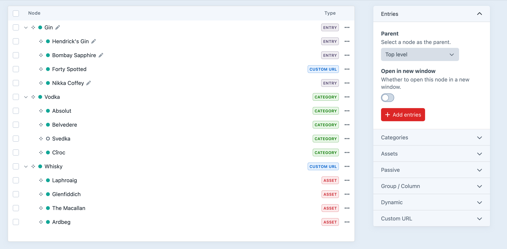

# Overview

A **menu** is a named collection of **nodes** — the links and structural items that make up your navigation tree. In the control panel, menus live under **Navigation → Menus**.

## Create a Menu

1. Go to **Navigation → Menus** and click **New menu**.
2. Set a name, such as **Main Menu**, and a handle, such as `mainMenu`. The handle is the name your templates use to find this menu.
3. Configure site settings, permissions, and limits on the settings screen.
4. Save, then open the menu to use the **menu builder**.

## Menu Builder

In the menu builder you can:

- Add nodes from the sidebar (entries, categories, custom URLs, passive groups, Dynamics, and more).
- Drag nodes to reorder or nest them.
- Edit a node in a slide-out for per-node settings and custom fields.
- Change structure, add nodes, or mark nodes for deletion — then **Save menu** or **Discard** when you are done.

With the default settings, changes to the tree stay pending until you save. If your project enables `builderLiveStructure`, structure changes save immediately; check [Configuration](/get-started/configuration) when your builder behaves differently.

## Linked Elements

When a node links to a Craft element (entry, category, etc.), the node **title** and **enabled** state sync from that element by default. Override the title or enabled state in the node editor when you need menu-specific values.

If the linked element is soft-deleted, the node is disabled automatically and restored when the element is restored. See [Events — Linked-element lifecycle](/developers/events).

## Multisite

Enable a menu on the sites where it should appear. Switch sites in the builder when a link needs a different destination or suffix in another locale. **Navigation → Settings** controls whether menus are automatically enabled on newly created sites. See [Multisite Menus](/user-guides/configuration/multisite-menus) for propagation and title translation choices.

After saving your menu, follow [Rendering Nodes](/template-guides/rendering-nodes) to display it in a Twig template. Add [Menu Fields](/feature-tour/menu-fields) when the menu needs shared content, such as a heading or image for a mega menu.
