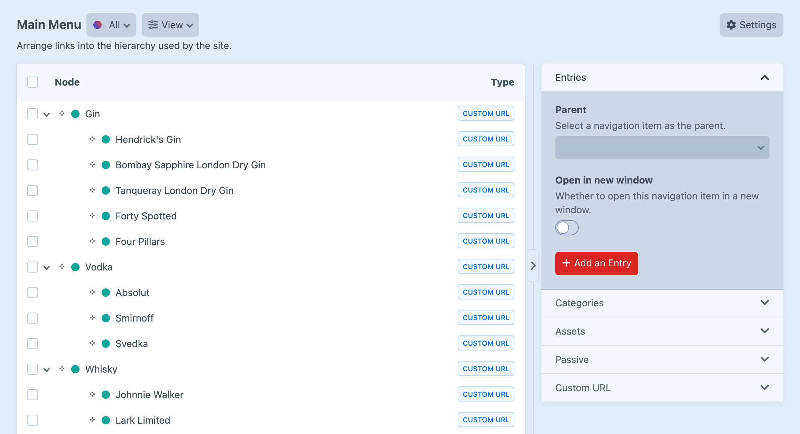

<!-- feature-intro -->
Manage navigation menus for your Craft site. Link to existing elements such as entries, categories and products, add custom URLs, and arrange the hierarchy without forcing the content tree to double as the menu.
<!-- feature-intro-end -->

<!-- feature-grid -->
- :icon[brand-craft] **Nodes are elements** Query navigation nodes in the familiar ways you already use for entries and other Craft elements.
- :icon[sitemap] **Entries, categories and more** Link entries, assets, categories, Commerce products and other supported elements.
- :icon[link] **Custom URLs** Add external sites, anchors and destinations that do not belong to a Craft element.
- :icon[adjustments-horizontal] **Node options** Enable or disable a node, open it in a new window, or add project-specific CSS classes.
- :icon[refresh] **Smart updating** Let a node follow changes to its linked element’s title and status, unless you choose to override them.
- :icon[world] **Multi-site support** Manage navigation values and propagation across the project’s sites.
<!-- feature-grid-end -->

<!-- feature-section media-size="full" -->
## Flexible menu structures

Create as many navigations as the site needs and arrange their nodes independently of Craft’s section structure. Authors can build headers, footers, utility menus and deeply nested structures, with custom fields when a link needs more than a label and URL.

<!-- feature-section-end -->

<!-- feature-grid -->
- :icon[template] **Templating** Use Navigation’s Twig renderer or query the structure and supply all the markup yourself.
- :icon[route] **Breadcrumbs** Build breadcrumb data from the current URL and navigation structure.
- :icon[plug-connected] **Third-party hooks** Add support for custom element types through straightforward extension points.
- :icon[api] **GraphQL** Query navigations and nodes for decoupled front ends.
<!-- feature-grid-end -->
